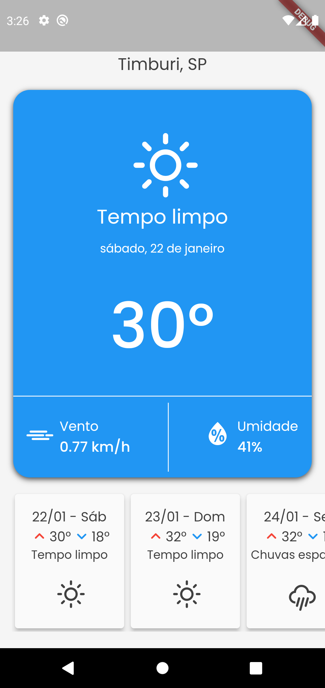
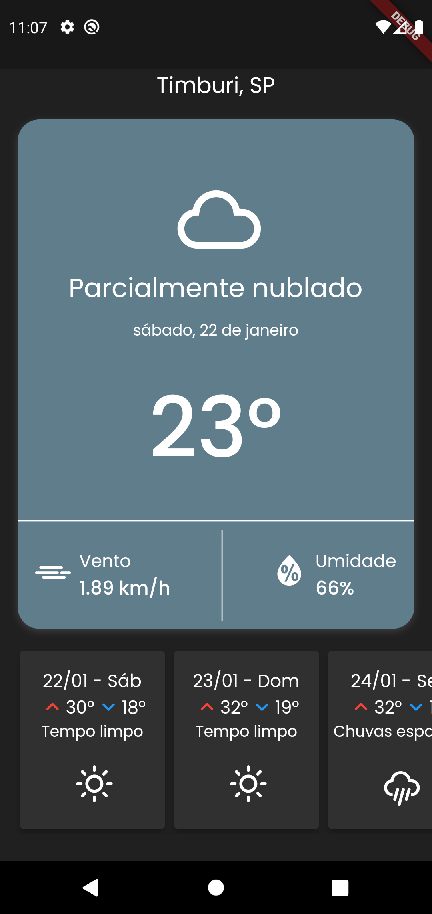

# weatherapp

Um projeto de previsão do tempo com flutter, mobx como gerenciador de estado e consumo de API.

## Imagens sobre o app

<table>
  <tr>
    <td valign="top"></td>
    <td valign="top"></td>
  </tr>
</table>
